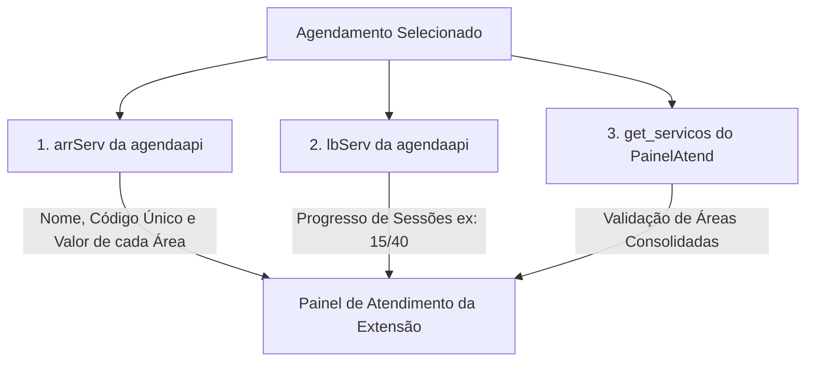
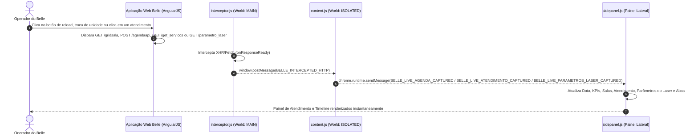
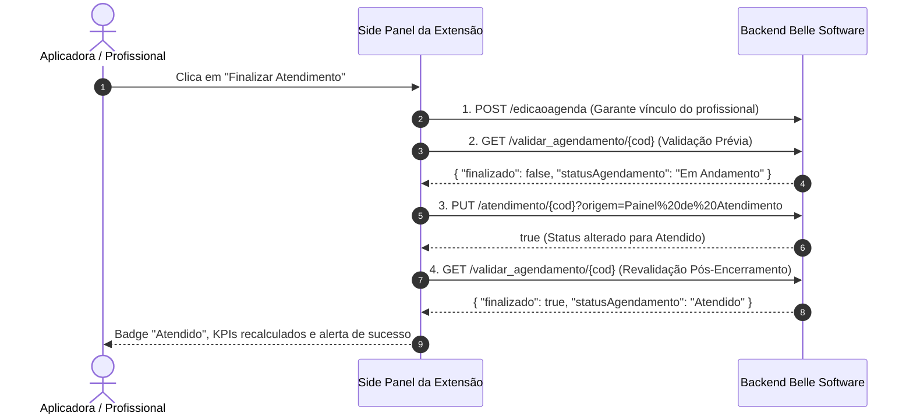
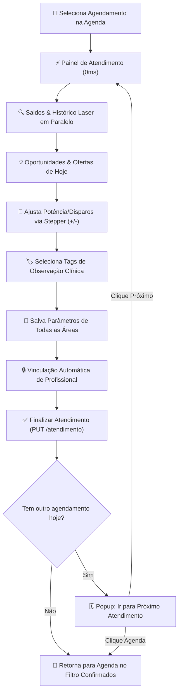

# Mapeamento Técnico Completo: Passo a Passo, Arquitetura Modular & APIs (Belle Software)

Este documento registra a documentação técnica oficial, exaustiva e passo a passo de todas as requisições, endpoints HTTP, cabeçalhos, parâmetros de URL, payloads de envio (Request Body), respostas completas (Response JSON), arquitetura modular em ES Modules, RBAC e motores inteligentes da extensão **Belle Copilot | Laser & Vendas**.

---

## 🗺️ Índice Geral do Passo a Passo

1. [Passo 1: Autenticação, Sessão e Identificação do Usuário](#passo-1-autenticação-sessão-e-identificação-do-usuário)
2. [Passo 2: Consulta de Estabelecimentos do Usuário](#passo-2-consulta-de-estabelecimentos-do-usuário)
3. [Passo 3: Consulta do Grid de Salas por Unidade (gridsala)](#passo-3-consulta-do-grid-de-salas-por-unidade-gridsala)
4. [Passo 4: Consulta de Salas e Tempos de Atendimento do Dia (salas)](#passo-4-consulta-de-salas-e-tempos-de-atendimento-do-dia-salas)
5. [Passo 5: Consulta da Grade Completa de Agendamentos do Dia (agendaapi)](#passo-5-consulta-da-grade-completa-de-agendamentos-do-dia-agendaapi)
6. [Passo 6: Consulta da Ficha e Saldo de Pacotes do Cliente (vendasplanos)](#passo-6-consulta-da-ficha-e-saldo-de-pacotes-do-cliente-vendasplanos)
7. [Passo 7: Consulta do Detalhamento de Sessões e Saldo por Serviço (saldovendaplano)](#passo-7-consulta-do-detalhamento-de-sessões-e-saldo-por-serviço-saldovendaplano)
8. [Passo 8: Painel de Atendimento & Consulta de Serviços (get_servicos)](#passo-8-painel-de-atendimento--consulta-de-serviços-get_servicos)
9. [Passo 9: Consulta e Inclusão de Parâmetros do Laser (parametro_laser)](#passo-9-consulta-de-parâmetros-do-laser-parametro_laser)
10. [Passo 10: Ciclo de Vida da Interceptação em Tempo Real (interceptor.js & content.js)](#passo-10-ciclo-de-vida-da-interceptação-em-tempo-real-interceptorjs--contentjs)
11. [Passo 11: Estratégias de Otimização, Caching em Memória & Autonomia Operacional](#passo-11-estratégias-de-otimização-caching-em-memória--autonomia-operacional)
12. [Passo 12: Consulta de Detalhes & Vinculação de Profissional (detalhes_api & edicaoagenda)](#passo-12-consulta-de-detalhes--vinculação-de-profissional-detalhes_api--edicaoagenda)
13. [Passo 13: Fluxo Oficial de Finalização de Atendimento (validar_agendamento & PUT atendimento)](#passo-13-fluxo-oficial-de-finalização-de-atendimento-validar_agendamento--put-atendimento)
14. [Passo 14: Retorno Automático para a Agenda e Filtragem de Confirmados](#passo-14-retorno-automático-para-a-agenda-e-filtragem-de-confirmados)
15. [Passo 15: Motor de Ofertas Inteligentes & Cadência Clínica (Cross-Sell & Upsell)](#passo-15-motor-de-ofertas-inteligentes--cadência-clínica-cross-sell--upsell)
16. [Passo 16: Parâmetros da Empresa e Identidade Visual (Logo Oficial)](#16-passo-16-parâmetros-da-empresa-e-identidade-visual-logo-oficial)
17. [Passo 17: Arquitetura Modular em ES Modules (Desacoplamento & Manutenibilidade)](#17-passo-17-arquitetura-modular-em-es-modules)
18. [Passo 18: Controle de Acesso Baseado em Perfis (RBAC & Visão Gerencial)](#18-passo-18-controle-de-acesso-baseado-em-perfis-rbac)
19. [Passo 19: Sincronização Dinâmica e Autônoma de Data da Agenda](#19-passo-19-sincronização-dinâmica-de-data-da-agenda)
20. [Passo 20: Renderização Instantânea em 0ms (lbServ & saldovendaplano)](#20-passo-20-renderização-instantânea-em-0ms-lbserv--saldovendaplano)

---

## Passo 1: Autenticação, Sessão e Identificação do Usuário

Ao abrir a extensão ou ao carregar a página do Belle Software, a extensão identifica o usuário autenticado e seus privilégios de acesso.

### 1.1. Detalhes da Requisição
* **Finalidade:** Retorna o perfil completo do usuário logado (nome, login, e-mail, grupo de permissões e configurações).
* **Método:** `GET`
* **URL:**
```http
https://app.bellesoftware.com.br/api/release/controller/Login/v1.0/{codUsuario}/recuperar_dados?estabGeral=
```
* **Headers:**
```http
Host: app.bellesoftware.com.br
authorization: {token_unidade}
accept: application/json, text/plain, */*
referer: https://app.bellesoftware.com.br/u/{unidade}/agenda
```

### 1.2. JSON de Resposta (Response Body)
```json
{
  "cod_usuario": "master-admin",
  "nom_usuario": "Master - Patrícia Karla",
  "login": "master-admin",
  "email": "contato@esteticaelaser.com.br",
  "ativo": 1,
  "grupos": [
    {
      "id": 1,
      "nome": "Master / Administrador Geral",
      "nivel": 10
    }
  ],
  "foto": null,
  "configuracoes": {
    "exibir_valores": true,
    "pode_cancelar": true,
    "pode_estornar": true,
    "acesso_todas_unidades": true
  }
}
```

### 1.3. Dicionário de Campos do JSON (`recuperar_dados`)
| Campo | Tipo | Exemplo | Descrição no Sistema |
| :--- | :--- | :--- | :--- |
| **`cod_usuario`** | `String` | `"master-admin"` | Código identificador ou login do usuário no sistema. |
| **`nom_usuario`** | `String` | `"Master - Patrícia Karla"` | Nome completo exibido no cabeçalho do Side Panel. |
| **`login`** | `String` | `"master-admin"` | Nome de usuário utilizado na autenticação. |
| **`email`** | `String` | `"contato@esteticaelaser.com.br"` | E-mail do usuário. |
| **`ativo`** | `Integer` | `1` | `1` se o usuário estiver com cadastro ativo; `0` se inativo. |
| **`grupos`** | `Array` | `[...]` | Lista de perfis de permissão do usuário. |
| **`grupos[].id`** | `Integer` | `1` | Identificador numérico do grupo de acesso. |
| **`grupos[].nome`** | `String` | `"Master / Administrador Geral"` | Nome do perfil/cargo (exibido como badge no topo). |
| **`configuracoes`** | `Object` | `{...}` | Flags de permissões financeiras e operacionais da sessão. |

---

## Passo 2: Consulta de Estabelecimentos do Usuário

Retorna todas as filiais e clínicas às quais o usuário tem acesso cadastrado.

### 2.1. Detalhes da Requisição
* **Finalidade:** Listar os nomes, códigos e dados cadastrais de todas as clínicas da rede.
* **Método:** `GET`
* **URL:**
```http
https://app.bellesoftware.com.br/api/release/controller/Usuario/v1.0/estabelecimentos_do_usuario?estabGeral=
```
* **Headers:**
```http
Host: app.bellesoftware.com.br
authorization: {token_unidade}
accept: application/json, text/plain, */*
```

### 2.2. JSON de Resposta (Response Body)
```json
[
  {
    "cod": 1,
    "nome": "ESTETICA E LASER LINHARES",
    "razao_social": "ESTETICA E LASER LINHARES LTDA",
    "cnpj": "12.345.678/0001-90",
    "uf": "ES",
    "cidade": "Linhares",
    "padrao": 1,
    "ativo": 1
  },
  {
    "cod": 5,
    "nome": "ESTETICA E LASER ARACRUZ",
    "razao_social": "ESTETICA E LASER ARACRUZ LTDA",
    "cnpj": "23.456.789/0001-01",
    "uf": "ES",
    "cidade": "Aracruz",
    "padrao": 0,
    "ativo": 1
  }
]
```

### 2.3. Dicionário de Campos do JSON (`estabelecimentos_do_usuario`)
| Campo | Tipo | Exemplo | Descrição no Sistema |
| :--- | :--- | :--- | :--- |
| **`cod`** | `Integer` | `1` | ID numérico da unidade (corresponde à URL `/u/{cod}/agenda`). |
| **`nome`** | `String` | `"ESTETICA E LASER LINHARES"` | Nome fantasia da clínica exibido na interface. |
| **`razao_social`** | `String` | `"ESTETICA E LASER LINHARES LTDA"` | Razão social cadastrada. |
| **`cnpj`** | `String` | `"12.345.678/0001-90"` | CNPJ da unidade. |
| **`uf`** | `String` | `"ES"` | Estado da filial. |
| **`cidade`** | `String` | `"Linhares"` | Município da unidade. |
| **`padrao`** | `Integer` | `1` | `1` se for a unidade principal/padrão do usuário. |

---

## Passo 3: Consulta do Grid de Salas por Unidade (`gridsala`)

Endpoint oficial executado pelo Belle Software para obter a estrutura completa de salas da unidade ativa.

### 3.1. Detalhes da Requisição
* **Finalidade:** Retorna as salas da clínica atual para preencher o dropdown de salas (`selectProfissional`) e montar o `arrGrid` para o endpoint `agendaapi`.
* **Método:** `GET`
* **URL:**
```http
https://app.bellesoftware.com.br/api/release/controller/Agenda/v1.0/gridsala?etb={codEstab}&restringe=0&estabGeral=1
```
* **Headers:**
```http
Host: app.bellesoftware.com.br
authorization: {token_unidade}
accept: application/json, text/plain, */*
referer: https://app.bellesoftware.com.br/u/{codEstab}/agenda
```

### 3.2. JSON de Resposta (Response Body - Unidade #5 Aracruz)
```json
[
  {
    "id_geinfo": 103868,
    "codigo": 922280,
    "login": "master-admin",
    "cod_tipo": 1,
    "cod_sala": 25664,
    "todos": "1",
    "id": 25664,
    "cod_clinica": "1",
    "nom_clinica": "ESTETICA E LASER ARACRUZ",
    "nome": "AVALIAÇÃO NOVOS CLIENTES ",
    "tempo": "5",
    "limite": 1,
    "foto": "",
    "title": "AVALIAÇÃO NOVOS CLIENTES "
  },
  {
    "id_geinfo": 103868,
    "codigo": 922281,
    "login": "master-admin",
    "cod_tipo": 2,
    "cod_sala": 25665,
    "todos": "1",
    "id": 25665,
    "cod_clinica": "1",
    "nom_clinica": "ESTETICA E LASER ARACRUZ",
    "nome": "SALA DEPILAÇAO A LASER ",
    "tempo": "5",
    "limite": 1,
    "foto": "",
    "title": "SALA DEPILAÇAO A LASER "
  },
  {
    "id_geinfo": 103868,
    "codigo": 922282,
    "login": "master-admin",
    "cod_tipo": 2,
    "cod_sala": 46546,
    "todos": "1",
    "id": 46546,
    "cod_clinica": "1",
    "nom_clinica": "ESTETICA E LASER ARACRUZ",
    "nome": "PROCEDIMENTOS  A LASER ",
    "tempo": "5",
    "limite": 1,
    "foto": "",
    "title": "PROCEDIMENTOS  A LASER "
  }
]
```

### 3.3. Dicionário de Campos do JSON (`gridsala`)
| Campo | Tipo | Exemplo | Descrição no Sistema |
| :--- | :--- | :--- | :--- |
| **`id_geinfo`** | `Integer` | `103868` | Identificador do grupo econômico/empresa no banco de dados. |
| **`codigo`** | `Integer` | `922280` | Código sequencial da coluna de exibição no grid. |
| **`cod_sala` / `id`** | `Integer` | `25664` | ID único da sala física de atendimento. |
| **`cod_tipo`** | `Integer` | `1` | Tipo do recurso (`1` = Avaliação / Recepção, `2` = Procedimento / Sala de Laser). |
| **`nom_clinica`** | `String` | `"ESTETICA E LASER ARACRUZ"` | Nome oficial da unidade ativa retornado pelo grid. |
| **`nome` / `title`** | `String` | `"SALA DEPILAÇAO A LASER "` | Nome descritivo da sala exibido nas opções de filtro. |
| **`tempo`** | `String` | `"5"` | Intervalo padrão em minutos da grade horária (ex: 5 min). |
| **`limite`** | `Integer` | `1` | Capacidade máxima de agendamentos simultâneos na sala. |

---

## Passo 4: Consulta de Salas e Tempos de Atendimento do Dia (`salas`)

Endpoint de consulta de salas ativas para um dia específico da semana.

### 4.1. Detalhes da Requisição
* **Método:** `GET`
* **URL:**
```http
https://app.bellesoftware.com.br/api/release/controller/Agenda/v1.0/salas?dia={diaSemana}&etb={codEstab}&restrito=0&tp=2&estabGeral=1
```
* **Parâmetros da Query:**
  * `dia`: Dia da semana (`0` = Domingo, `1` = Segunda, ..., `6` = Sábado).
  * `etb`: Código do estabelecimento (ex: `1` ou `5`).
  * `restrito`: Flag de restrição (`0` = sem restrição).
  * `tp`: Tipo de recurso (`2` = Salas).
  * `estabGeral`: Escopo geral (`1`).

### 4.2. JSON de Resposta (Response Body - Unidade #1 Linhares)
```json
[
  {
    "cod_usuario": "58770",
    "value": "58770",
    "nome": "AVALIAÇÃO NOVOS CLIENTES",
    "label": "AVALIAÇÃO NOVOS CLIENTES",
    "tempo_atendimento": "5"
  },
  {
    "cod_usuario": "67346",
    "value": "67346",
    "nome": "SALA DEPILAÇÃO A LASER - 02",
    "label": "SALA DEPILAÇÃO A LASER - 02",
    "tempo_atendimento": "5"
  },
  {
    "cod_usuario": "32147",
    "value": "32147",
    "nome": "SALA DEPILAÇÃO A LASER oficial -01",
    "label": "SALA DEPILAÇÃO A LASER oficial -01",
    "tempo_atendimento": "5"
  },
  {
    "cod_usuario": "7451",
    "value": "7451",
    "nome": "TRATAMENTO ND YAG",
    "label": "TRATAMENTO ND YAG",
    "tempo_atendimento": "10"
  }
]
```

### 4.3. Dicionário de Campos do JSON (`salas`)
| Campo | Tipo | Exemplo | Descrição no Sistema |
| :--- | :--- | :--- | :--- |
| **`cod_usuario` / `value`** | `String` | `"58770"` | ID da sala associado às consultas. |
| **`nome` / `label`** | `String` | `"AVALIAÇÃO NOVOS CLIENTES"` | Nome do recurso para o dropdown. |
| **`tempo_atendimento`** | `String` | `"5"` | Duração mínima de atendimento na sala (em minutos). |

---

## Passo 5: Consulta da Grade Completa de Agendamentos do Dia (`agendaapi`)

Endpoint central que consolida todos os atendimentos, pacientes, procedimentos, orçamentos, pacotes e bloqueios da data.

### 5.1. Detalhes da Requisição
* **Método:** `POST`
* **URL:**
```http
https://app.bellesoftware.com.br/api/release/controller/Agenda/v1.0/agendaapi?estabGeral=1
```
* **Headers:**
```http
Host: app.bellesoftware.com.br
authorization: {token_unidade}
content-type: text/plain
accept: application/json, text/plain, */*
referer: https://app.bellesoftware.com.br/u/{unidade}/agenda
```

### 5.2. Payload da Requisição (Request Body JSON)
```json
{
  "tp": "0",
  "canc": false,
  "finan": false,
  "codCli": "",
  "finaliz": false,
  "corInad": "#e19999",
  "arrGrid": [
    {
      "id_geinfo": 103868,
      "codigo": 922280,
      "login": "master-admin",
      "cod_tipo": 1,
      "cod_sala": 25664,
      "todos": "1",
      "id": 25664,
      "cod_clinica": "1",
      "nom_clinica": "ESTETICA E LASER ARACRUZ",
      "nome": "AVALIAÇÃO NOVOS CLIENTES ",
      "tempo": "5",
      "limite": 1,
      "title": "AVALIAÇÃO NOVOS CLIENTES ",
      "businessHours": [
        {"daysOfWeek":[1],"startTime":"07:50","endTime":"12:00"},
        {"daysOfWeek":[1],"startTime":"12:00","endTime":"20:10"},
        {"daysOfWeek":[2],"startTime":"07:50","endTime":"12:00"},
        {"daysOfWeek":[2],"startTime":"12:00","endTime":"20:10"},
        {"daysOfWeek":[3],"startTime":"07:50","endTime":"12:00"},
        {"daysOfWeek":[3],"startTime":"12:00","endTime":"20:10"},
        {"daysOfWeek":[4],"startTime":"07:50","endTime":"12:00"},
        {"daysOfWeek":[4],"startTime":"12:00","endTime":"20:10"},
        {"daysOfWeek":[5],"startTime":"07:50","endTime":"12:00"},
        {"daysOfWeek":[5],"startTime":"12:00","endTime":"20:10"},
        {"daysOfWeek":[6],"startTime":"07:50","endTime":"17:00"}
      ]
    }
  ],
  "semFinan": false,
  "tpAgenda": "sala",
  "dtAgenda": "2026-08-29, 00:00:00",
  "corAgenda": "ct",
  "semFinaliz": false,
  "destacarInad": "1",
  "destacarPendCont": 1,
  "corPendContrato": "#6b86dd",
  "corAgendSemQuest": "#e1d783",
  "destacarNaoPreencQuest": 1,
  "verTodas": 1,
  "exibir_pc_agenda": "1",
  "destacarNomeInad": "1",
  "teleatendimento": 0,
  "etb": "5"
}
```

### 5.3. JSON de Resposta Completo (Response Body com 3 Casos Reais)
```json
[
  {
    "cod_consulta": 0,
    "hrIni": "12:00",
    "hrFim": "13:00",
    "dt_consulta": "2026-08-29",
    "status": "Bloqueado",
    "bloqueado": "23820825",
    "lbBloqueio": "desmarcar",
    "codTipo": 25665,
    "resourceId": 25665,
    "sala": "SALA DEPILAÇAO A LASER ",
    "backgroundColor": "#fb5e5e",
    "title": "Bloqueado - Intervalo Almoço"
  },
  {
    "cod_consulta": 71706597,
    "hrIni": "08:00",
    "hrFim": "08:25",
    "dt_consulta": "2026-08-29",
    "status": "Em Andamento",
    "cod_tipo_consulta": "Serviço",
    "cod_paciente": "15810416",
    "nom_paciente": "GILMARA CORREA ROSA ",
    "celular": "(27)99908-9849",
    "celularPuro": "(27)99908-9849",
    "ddiCelular": "55",
    "email": "gilmara.armini@gmail.com",
    "cpf": "058.659.107-95",
    "logradouro": "Rua Olindo Barcelos Soeiro",
    "dtNascimento": "1987-11-16",
    "idadeNaOcasiao": "38",
    "tipo_plano": "orc",
    "cod_plano_paciente": "408822302",
    "cod_plano": "58776949",
    "nome_plano": "17 - VIRILHA COMPLETA 10SS + PERIANAL 10SS + AXILAS 10SS + BUÇO 10SS - COMBO VERÃO",
    "sala": "SALA DEPILAÇAO A LASER ",
    "codTipo": 25665,
    "resourceId": 25665,
    "cod_profissional": "82700",
    "nom_usuario": "BARBARA MARTINS",
    "tagsCliente": null,
    "quest_pendente": true,
    "fazAniver": false,
    "lbServ": "AXILAS (P) - depilação a laser - 15/40<br>BUÇO (P) depilação a laser. - 15/40<br>PERIANAL (P) - depilação a laser. - 15/40<br>VIRILHA COMPLETA EXCETO ANAL (M) - depilação a laser. - 15/40",
    "arrServ": [
      { "nome": "AXILAS (P) - depilação a laser", "cod_servico": 55556418, "valor": "30" },
      { "nome": "BUÇO (P) depilação a laser", "cod_servico": 55556419, "valor": "30" },
      { "nome": "PERIANAL (P) - depilação a laser", "cod_servico": 55556430, "valor": "60" },
      { "nome": "VIRILHA COMPLETA EXCETO ANAL (M) - depilação a laser", "cod_servico": 55556447, "valor": "140" }
    ],
    "backgroundColor": "#e1d783",
    "observacao": "OK"
  },
  {
    "cod_consulta": 72089909,
    "hrIni": "08:40",
    "hrFim": "09:15",
    "dt_consulta": "2026-08-29",
    "status": "Atendido",
    "cod_tipo_consulta": "Serviço",
    "cod_paciente": "15097976",
    "nom_paciente": "ARIANI CALDEIRO DE SOUZA ",
    "celular": "(27)99822-7638",
    "cpf": "148.789.697-25",
    "cod_plano_paciente": "408414805",
    "nome_plano": "1- VIRILHA COMPLETA 10SS + MEIA PERNA 10SS + GANHE 10SS AXILAS +10SS PERIANAL - COMBO VERÃO",
    "sala": "SALA DEPILAÇAO A LASER ",
    "codTipo": 25665,
    "resourceId": 25665,
    "nom_usuario": "PAMELA MARTINS LOSS",
    "tagsCliente": "INADIMPLENTE-PARCELA, LEAD CORTESIA",
    "quest_pendente": false,
    "fazAniver": true,
    "arrServ": [
      { "nome": "AXILAS (P) - depilação a laser", "cod_servico": 55556418, "valor": "30" },
      { "nome": "PERIANAL (P) - depilação a laser", "cod_servico": 55556430, "valor": "60" },
      { "nome": "VIRILHA COMPLETA EXCETO ANAL (M) - depilação a laser", "cod_servico": 55556447, "valor": "140" },
      { "nome": "MEIA PERNA (M) - depilação a laser", "cod_servico": 55557855, "valor": "200" }
    ],
    "backgroundColor": "#80d760"
  }
]
```

### 5.4. Dicionário Completo de Campos do JSON (`agendaapi`)
| Campo | Tipo | Exemplo | Descrição no Sistema & Uso na Extensão |
| :--- | :--- | :--- | :--- |
| **`cod_consulta`** | `Integer` | `71706597` | ID do agendamento (`0` para bloqueios de sala). |
| **`hrIni`** | `String` | `"08:00"` | Horário de início do atendimento (`HH:MM`). |
| **`hrFim`** | `String` | `"08:25"` | Horário previsto de término do atendimento (`HH:MM`). |
| **`dt_consulta`** | `String` | `"2026-08-29"` | Data da consulta no formato `YYYY-MM-DD`. |
| **`status`** | `String` | `"Em Andamento"` | Status no Belle (`Agendado`, `Confirmado`, `Em Andamento`, `Atendido`, `Falta`, `Bloqueado`). |
| **`nom_paciente`** | `String` | `"GILMARA CORREA ROSA "` | Nome do cliente exibido no card. |
| **`cod_paciente`** | `String` | `"15810416"` | Código do prontuário do cliente no Belle. |
| **`celular` / `celularPuro`** | `String` | `"(27)99908-9849"` | Telefone celular formatado para o integrador do WhatsApp. |
| **`ddiCelular`** | `String` | `"55"` | Código DDI do país (Brasil = 55). |
| **`cpf`** | `String` | `"058.659.107-95"` | CPF do cliente utilizado na consulta de saldo financeiro. |
| **`email`** | `String` | `"gilmara.armini@gmail.com"` | E-mail do cliente. |
| **`cod_plano_paciente`** | `String` | `"408822302"` | Número do orçamento/venda do pacote de sessões. |
| **`cod_plano`** | `String` | `"58776949"` | Código do modelo do pacote. |
| **`nome_plano`** | `String` | `"17 - COMBO VERÃO"` | Nome do pacote/combo comercial adquirido. |
| **`sala`** | `String` | `"SALA DEPILAÇAO A LASER "` | Nome da sala onde o cliente será atendido. |
| **`codTipo` / `resourceId`** | `Integer` | `25665` | ID da sala associada ao filtro `selectProfissional`. |
| **`cod_profissional`** | `String` | `"82700"` | ID da profissional de atendimento. |
| **`nom_usuario`** | `String` | `"BARBARA MARTINS"` | Nome da profissional/operadora responsável. |
| **`arrServ`** | `Array` | `[...]` | Lista de procedimentos e valores incluídos neste atendimento. |
| **`arrServ[].nome`** | `String` | `"AXILAS (P)"` | Nome do procedimento (exibido em chip visual). |
| **`arrServ[].cod_servico`** | `Integer` | `55556418` | ID único do procedimento. |
| **`arrServ[].valor`** | `String` | `"30"` | Valor unitário atribuído ao serviço. |
| **`lbServ`** | `String` | `"AXILAS 15/40..."` | Texto com progresso de sessões de cada procedimento. |
| **`tagsCliente`** | `String` | `"INADIMPLENTE-PARCELA"` | Tags comerciais/financeiras (exibidas como badges coloridas). |
| **`quest_pendente`** | `Boolean` | `true` | `true` indica pendência de preenchimento de anamnese (`⚠️ Anamnese Pendente`). |
| **`fazAniver`** | `Boolean` | `true` | `true` se a cliente fizer aniversário no dia (`🎂 Aniversariante`). |
| **`backgroundColor`** | `String` | `"#e1d783"` | Cor original de destaque atribuída pelo Belle. |
| **`observacao`** | `String` | `"OK"` | Observação clínica ou operacional inserida no agendamento. |
| **`bloqueado` / `lbBloqueio`**| `String` | `"23820825"` | Identificadores de bloqueio de horário (`⚪ Bloqueado`). |

---

## Passo 6: Consulta da Ficha e Saldo de Pacotes do Cliente (`vendasplanos`)

Endpoint utilizado na aba **🔍 Ficha & Saldo** para pesquisar pacotes e histórico de contratos de um cliente.

### 6.1. Detalhes da Requisição
* **Método:** `GET`
* **URL:**
```http
https://app.bellesoftware.com.br/api/release/controller/Plano/v1.0/vendasplanos?dtIni=2021-01-01T03:00:00.000Z&dtFim=2026-08-29T03:00:00.000Z&codEstab=1&codCliente=&codVendedor=&codOrc=408491812&status=&origem=Ambos&tpPlan=&pfCmp=&ckClass=1&rating=0&nomePlan=&ord=&cres=0&vencidos=0&tpDt=0&codCamp=&indicacao=&ckFinan=0&somenteCortesia=0&valorIni=0&valorFim=0&contrato=&limit=10&offset=0&somenteSaldo=0&estabGeral=1
```
* **Headers:**
```http
authorization: {token_unidade}
accept: application/json, text/plain, */*
```

### 6.2. JSON de Resposta (Response Body)
```json
{
  "qtdRegistros": 1,
  "registros": [
    {
      "cod_orcamento": 408491812,
      "cod_paciente": 15269037,
      "nom_paciente": "PAULA ROBERTA FURLANE ZOTTELE",
      "cod_clinica": "1",
      "nom_clinica": "ESTETICA E LASER LINHARES",
      "cod_plano": 58776949,
      "nomePlano": "17 - VIRILHA COMPLETA 10SS + PERIANAL 10SS + AXILAS 10SS + BUÇO 10SS - COMBO VERÃO",
      "dtProp": "10/11/2025",
      "dtValPlano": "10/11/2027",
      "validade": 24,
      "preco": "2.396,00",
      "desconto": "70,00",
      "preco_final": "718,80",
      "stOrc": "Ativo",
      "status": "3",
      "saldo": "32",
      "celular": "(27)99958-9718",
      "cpf": "205.227.487-16",
      "email": "paulazotteli@gmail.com",
      "labelFormasPag": "005- *LINK* - PAGO LIVRE - CARTÃO DE CRÉDITO - 1X a 12X"
    }
  ]
}
```

### 6.3. Dicionário de Campos do JSON (`vendasplanos`)
| Campo | Tipo | Exemplo | Descrição no Sistema |
| :--- | :--- | :--- | :--- |
| **`cod_orcamento`** | `Integer` | `408491812` | ID da venda/contrato do plano. |
| **`nom_paciente`** | `String` | `"PAULA ROBERTA..."` | Nome da contratante. |
| **`nomePlano`** | `String` | `"17 - COMBO VERÃO"` | Nome comercial do plano de depilação. |
| **`preco`** | `String` | `"2.396,00"` | Valor de tabela (bruto) do contrato. |
| **`desconto`** | `String` | `"70,00"` | Percentual ou valor de desconto concedido. |
| **`preco_final`** | `String` | `"718,80"` | Valor líquido total contratado. |
| **`saldo`** | `String` | `"32"` | Total de sessões restantes em aberto no pacote. |
| **`stOrc`** | `String` | `"Ativo"` | Situação do pacote (`Ativo`, `Suspenso`, `Finalizado`, `Cancelado`). |
| **`dtValPlano`** | `String` | `"10/11/2027"` | Data limite de expiração do pacote. |
| **`labelFormasPag`** | `String` | `"005- CARTÃO..."` | Condição de pagamento negociada. |

---

## Passo 7: Consulta do Detalhamento de Sessões e Saldo por Serviço (`saldovendaplano`)

Endpoint oficial do Belle Software que discrimina o saldo de sessões de cada serviço/região do pacote vinculado ao agendamento (`cod_plano_paciente`).

### 7.1. Detalhes da Requisição
* **Método:** `GET`
* **URL:**
```http
https://app.bellesoftware.com.br/api/release/controller/Plano/v1.0/saldovendaplano?idGeinfo={idGeinfo}&estabGeral=1
```
* **Headers:**
```http
Host: app.bellesoftware.com.br
authorization: {token_unidade}
codorc: {cod_plano_paciente}
codplano: {cod_plano}
total: 1
tpplano: 0
accept: application/json, text/plain, */*
referer: https://app.bellesoftware.com.br/u/{unidade}/agenda
```

### 7.2. JSON de Resposta (Response Body)
```json
[
  {
    "codServ": 55556418,
    "nome": "AXILAS (P) - depilação a laser",
    "saldo_atual": "4",
    "quantidade": "10",
    "gasto": 6,
    "vlrser": "0.00",
    "consumir": "0,00",
    "verSaldo": true,
    "cor": "0x4bdf4b",
    "corApp": "#b9ff9f"
  },
  {
    "codServ": 55556430,
    "nome": "PERIANAL (P) - depilação a laser",
    "saldo_atual": "3",
    "quantidade": "10",
    "gasto": 7,
    "vlrser": "60.07",
    "consumir": "180,21",
    "verSaldo": true,
    "cor": "0x4bdf4b",
    "corApp": "#b9ff9f"
  },
  {
    "codServ": 55556447,
    "nome": "VIRILHA COMPLETA EXCETO  ANAL (M) - depilação a laser",
    "saldo_atual": "3",
    "quantidade": "10",
    "gasto": 7,
    "vlrser": "96.10",
    "consumir": "288,30",
    "verSaldo": true,
    "cor": "0x4bdf4b",
    "corApp": "#b9ff9f"
  },
  {
    "codServ": 55557855,
    "nome": "MEIA PERNA (M)  - depilação a laser",
    "saldo_atual": "3",
    "quantidade": "10",
    "gasto": 7,
    "vlrser": "163.40",
    "consumir": "490,20",
    "verSaldo": true,
    "cor": "0x4bdf4b",
    "corApp": "#b9ff9f"
  }
]
```

### 7.3. Dicionário de Campos do JSON (`saldovendaplano`)
| Campo | Tipo | Exemplo | Descrição no Sistema & Uso na Extensão |
| :--- | :--- | :--- | :--- |
| **`codServ`** | `Integer` | `55556418` | Código do serviço/procedimento no catálogo. |
| **`nome`** | `String` | `"AXILAS (P)..."` | Nome da área/região do procedimento. |
| **`quantidade`** | `String` | `"10"` | Quantidade total de sessões contratadas no plano. |
| **`gasto`** | `Integer` | `6` | **Sessões Realizadas** até o momento. |
| **`saldo_atual`** | `String` | `"4"` | **Saldo de Sessões Restantes** a realizar. |
| **`verSaldo`** | `Boolean` | `true` | Indica se o saldo é visível ao operador. |

> [!NOTE]
> Conforme requisito de negócio da clínica, a extensão **omite valores monetários** (`vlrser`, `consumir`), exibindo com exclusividade o progresso técnico das sessões (`Sessão {gasto}/{quantidade}`) e o saldo pendente (`{saldo_atual} restantes`).

---

## Passo 8: Painel de Atendimento & Consulta de Serviços (`get_servicos`)

Quando o operador clica em um agendamento na grade do Belle Software ou na timeline da extensão, o sistema abre a visualização clínica do atendimento.

### 8.1. Detalhes da Requisição
* **Finalidade:** Retorna a relação de serviços associados à consulta ativa e o código do procedimento primário.
* **Método:** `GET`
* **URL:**
```http
https://app.bellesoftware.com.br/api/release/controller/PainelAtend/v1.0/get_servicos/{cod_consulta}?estabGeral=1
```
* **Headers:**
```http
Host: app.bellesoftware.com.br
authorization: {token_unidade}
accept: application/json, text/plain, */*
referer: https://app.bellesoftware.com.br/u/{unidade}/agenda
```

### 8.2. JSON de Resposta (Response Body)
```json
{
  "servicos": "AXILAS (P) - depilação a laser, PERIANAL (P) - depilação a laser, JOELHO FEM. (P) - depilação a laser, VIRILHA COMPLETA EXCETO  ANAL (M) - depilação a laser, COXA COMPLETA (G) - depilação a laser, MEIA PERNA (M)  - depilação a laser",
  "cod_serv": 55556418
}
```

### 8.3. Dicionário de Campos do JSON (`get_servicos`)
| Campo | Tipo | Exemplo | Descrição no Sistema & Uso na Extensão |
| :--- | :--- | :--- | :--- |
| **`servicos`** | `String` | `"AXILAS (P)..., PERIANAL (P)..."` | Texto consolidado com todas as áreas/procedimentos que a cliente realizará no atendimento. |
| **`cod_serv`** | `Integer` | `55556418` | Código do serviço principal/cabeça do agendamento. |

---

### 8.4. Fusão Estruturada: `arrServ` + `lbServ` + `get_servicos`

Como o endpoint `get_servicos` retorna apenas o código de um único serviço primário (`cod_serv`), a extensão realiza a **fusão inteligente dos 3 dados**:



1. **`arrServ` (da `agendaapi`):** Fornece o `nome`, `cod_servico` e `valor` individual de cada uma das áreas agendadas.
2. **`lbServ` (da `agendaapi`):** Fornece o progresso individual de sessões de cada área (ex: `15/40`, `2/10`).
3. **`get_servicos` (do `PainelAtend`):** Confirma e valida a lista de procedimentos em tempo real ao abrir o atendimento no Belle.

---

## Passo 9: Consulta de Parâmetros do Laser (`parametro_laser`)

Quando o atendimento é aberto, a extensão consulta os parâmetros técnicos e potências aplicadas nas sessões anteriores do laser para orientar a profissional na aplicação de hoje.

### 9.1. Detalhes da Requisição
* **Finalidade:** Retorna o histórico de parâmetros técnicos aplicados no paciente (potência, fototipo, frequência, modo de aplicação e observações de áreas).
* **Método:** `GET`
* **URL:**
```http
https://app.bellesoftware.com.br/api/release/controller/PainelAtend/v1.0/parametro_laser?dataIni=2021-01-01T03:00:00.000Z&dataFim=2026-08-29T03:00:00.000Z&area=&desconsiderar=true&limit=20&offset=0&descData=1&sortField=data_hora&sortOrder=-1&cliente={cod_paciente}&estabGeral=1
```
* **Headers:**
```http
Host: app.bellesoftware.com.br
authorization: {token_unidade}
accept: application/json, text/plain, */*
referer: https://app.bellesoftware.com.br/u/{unidade}/agenda
```

### 9.2. JSON de Resposta (Response Body)
```json
{
  "registros": [
    {
      "id_geinfo": 114411,
      "id": 5791784,
      "cod_agendamento": 71099781,
      "area": "AXILAS VIRILHA PERIANAL MEIA PERNA",
      "fototipo": "IV",
      "densidade": 0,
      "cor_pelo": 0,
      "espessura_pelo": 0,
      "energia": "",
      "frequencia": "",
      "largura_pulso": "",
      "qtd_disparos": "",
      "modo_aplicacao": "HR",
      "observacao": "AXILAS 25 FT 5\nVIRILHA 25 FT 5\nLABIOS 15 FT 5\nPERIANAL 15 FT 5\n\nMEIA PERNA 30 FT 4",
      "anexo": "",
      "data_hora": "2026-07-11 15:56:28",
      "profissional": "PAMELA MARTINS LOSS",
      "assinatura": null
    },
    {
      "id_geinfo": 114411,
      "id": 5791751,
      "cod_agendamento": 71099782,
      "area": "BUÇO",
      "fototipo": "IV",
      "densidade": 0,
      "cor_pelo": 0,
      "espessura_pelo": 0,
      "energia": "",
      "frequencia": "",
      "largura_pulso": "",
      "qtd_disparos": "",
      "modo_aplicacao": "HR",
      "observacao": "BUÇO 15 FT 4",
      "anexo": "",
      "data_hora": "2026-07-11 15:51:06",
      "profissional": "PAMELA MARTINS LOSS",
      "assinatura": null
    }
  ],
  "qtdRegistros": 13
}
```

### 9.3. Dicionário de Campos do JSON (`parametro_laser`)
| Campo | Tipo | Exemplo | Descrição no Sistema & Uso na Extensão |
| :--- | :--- | :--- | :--- |
| **`id`** | `Integer` | `5791784` | ID do registro técnico de parâmetro no Belle. |
| **`cod_agendamento`** | `Integer` | `71099781` | ID da consulta na qual o parâmetro foi registrado. |
| **`area`** | `String` | `"AXILAS VIRILHA..."` | Áreas tratadas no registro técnico. |
| **`fototipo`** | `String` | `"IV"` | Classificação de fototipo da pele da cliente. |
| **`modo_aplicacao`** | `String` | `"HR"` | Modo de disparo do equipamento (ex: HR, SHR). |
| **`energia`** | `String` | `"30"` | Nível de energia / Joules configurados no laser. |
| **`frequencia`** | `String` | `"2Hz"` | Frequência de disparos por segundo. |
| **`largura_pulso`** | `String` | `"0.8"` | Largura do pulso emitida pela ponteira. |
| **`qtd_disparos`** | `String` | `"500"` | Contador de disparos efetuados na sessão. |
| **`observacao`** | `String` | `"AXILAS 25 FT 5\nVIRILHA 25..."` | **Campo Principal:** Notas de potências, joules e fototipos de cada região. |
| **`data_hora`** | `String` | `"2026-07-11 15:56:28"` | Data e hora exata em que os parâmetros foram salvos. |
| **`profissional`** | `String` | `"PAMELA MARTINS LOSS"` | Nome da profissional/aplicadora que realizou a sessão. |

---

### 9.4. Regra de Negócio: Consolidação de Todos os Registros do Último Dia
Como em um mesmo dia de atendimento a cliente pode ter múltiplos registros técnicos para regiões distintas (ex: um registro para corpo às 15:56 e outro registro para buço/face às 15:51):
1. A extensão identifica o **dia mais recente** (`data_hora` do primeiro item da lista ordenada decrescente).
2. Filtra e exibe **100% dos registros pertencentes a esse mesmo último dia**, garantindo que nenhuma área técnica seja omitida.

---

### 9.5. Gravação e Inclusão de Parâmetros Técnicos (`POST parametro_laser`)

Quando a profissional finaliza ou registra a sessão do laser, a extensão envia **uma requisição individual para cada área tratada** no agendamento.

#### A. Detalhes da Requisição
* **Finalidade:** Salvar os parâmetros técnicos aplicados em uma área específica de um agendamento.
* **Método:** `POST`
* **URL:**
```http
https://app.bellesoftware.com.br/api/release/controller/PainelAtend/v1.0/parametro_laser?estabGeral=1
```
* **Headers:**
```http
Host: app.bellesoftware.com.br
authorization: {token_unidade}
content-type: text/plain
accept: application/json, text/plain, */*
referer: https://app.bellesoftware.com.br/u/{unidade}/painel-atendimento/parametro-laser
```

#### B. Payload de Envio (Request Body)
```json
{
  "id": null,
  "codAgendamento": "71706597",
  "area": "55556418 - AXILAS (P) - depilação a laser",
  "fototipo": "IV",
  "densidade": 0,
  "cor": 0,
  "espessura": 0,
  "energia": "35",
  "frequencia": "0,8",
  "larguraPulso": null,
  "qtdDisparos": "200",
  "modoAplicacao": "HR",
  "observacao": "AXILAS 35 FT 4 - boa tolerância",
  "anexo": null
}
```

#### C. Dicionário de Campos do Payload (`POST parametro_laser`)
| Campo | Tipo | Exemplo | Descrição & Regra |
| :--- | :--- | :--- | :--- |
| **`id`** | `null` | `null` | Deve ser enviado como `null` para novas inclusões. |
| **`codAgendamento`** | `String` | `"71706597"` | Código identificador da consulta (`cod_consulta`). |
| **`area`** | `String` | `"55556418 - AXILAS (P)..."` | Formatação padronizada: `{cod_servico} - {nome_servico}`. |
| **`fototipo`** | `String` | `"IV"` | Classificação de fototipo de Fitzpatrick (I, II, III, IV, V, VI). |
| **`modoAplicacao`** | `String` | `"HR"` | Modo de disparo (`HR`, `SHR`, `STAMP`). |
| **`energia`** | `String` | `"35"` | Potência / Joules aplicados na região. |
| **`frequencia`** | `String` | `"0,8"` | Frequência de repetição dos disparos. |
| **`larguraPulso`** | `String/null`| `null` ou `"0.8"` | Largura do pulso em milissegundos. |
| **`qtdDisparos`** | `String` | `"200"` | Quantidade de disparos efetuados na área. |
| **`observacao`** | `String` | `"AXILAS 35 FT 4..."` | Notas clínicas e intercorrências da área. |
| **`densidade` / `cor` / `espessura`** | `Integer` | `0` | Parâmetros auxiliares padrão (`0`). |
| **`anexo`** | `null` | `null` | Anexos adicionais (`null`). |

#### D. Resposta do Servidor (Response Body)
```json
true
```

#### E. Regras de Negócio e Segurança Implementadas:
1. **Auto-Preenchimento Inteligente**: Cada card de área é populado automaticamente com os valores da **última sessão** da cliente para aquela mesma região.
2. **Trava de Segurança (Parâmetros Sem Evolução)**: Se a profissional tentar salvar parâmetros idênticos aos da sessão anterior sem alterar a potência/modo, a extensão bloqueia o salvamento automático e exibe um modal de confirmação com a lista das áreas sem evolução.
3. **Salvamento em Lote**: Ao clicar em `💾 Salvar Parâmetros`, a extensão itera sobre todas as áreas ativas e executa as requisições de forma sequencial com feedback de progresso em tempo real.

---

## Passo 10: Ciclo de Vida da Interceptação em Tempo Real (`interceptor.js` & `content.js`)

Fluxo completo de captura instantânea de dados da tela do Belle Software para o Side Panel:



---

## Passo 11: Estratégias de Otimização, Caching em Memória & Autonomia Operacional

Para proporcionar uma experiência instantânea (tempo de resposta < 50ms) e garantir que a extensão funcione de forma autônoma sem depender de cliques na tela do Belle, foram implementadas as seguintes camadas de otimização:

### 11.1. Tabela Resumo de Todas as Requisições da Extensão

| Passo | Endpoint | Método | Identificadores Obrigatórios | Formato / Localização dos Parâmetros |
| :---: | :--- | :---: | :--- | :--- |
| **01** | `/Login/v1.0/{codUsuario}/recuperar_dados` | `GET` | `cod_usuario` | Path Parameter + Header `authorization` |
| **02** | `/Usuario/v1.0/estabelecimentos_do_usuario` | `GET` | — | Header `authorization` |
| **03** | `/Agenda/v1.0/gridsala` | `GET` | `etb=1`, `estabGeral=1` | Query Params + Header `authorization` |
| **04** | `/Agenda/v1.0/salas` | `GET` | `diaSemana`, `cod_estab=1` | Query Params + Header `authorization` |
| **05** | `/Agenda/v1.0/agendaapi` | `POST` | `arrGrid`, `dtAgenda` | JSON Request Body + Header `authorization` |
| **06** | `/Plano/v1.0/vendasplanos` | `GET` | `codOrc`, `estabGeral=1` | Query Params + Header `authorization` |
| **07** | `/Plano/v1.0/saldovendaplano` | `GET` | `codorc`, `codplano`, `idGeinfo` | **Custom Headers** (`codorc`, `codplano`, `total`, `tpplano`) + Query `idGeinfo` |
| **08** | `/PainelAtend/v1.0/get_servicos/{cod}` | `GET` | `cod_consulta` | Path Parameter + Header `authorization` |
| **09** | `/PainelAtend/v1.0/parametro_laser` | `GET` | `cliente={cod_paciente}` | Query Params + Header `authorization` |
| **10** | `/PainelAtend/v1.0/parametro_laser` | `POST` | `codAgendamento`, `area`, `energia`, etc. | **JSON Body** (1 requisição por área) + Header `authorization` |
| **11** | `/Agenda/v1.0/detalhes_api/{cod}` | `GET` | `codAgenda` | Path Parameter + Header `authorization` |
| **12** | `/Agenda/v1.0/edicaoagenda` | `POST` | `detalhes` (com `codProfiss`, `nomProf`) | **JSON Body** + Header `authorization` |
| **13** | `/PainelAtend/v1.0/validar_agendamento/{cod}` | `GET` | `codConsulta` | Path Parameter + Header `authorization` |
| **14** | `/PainelAtend/v1.0/atendimento/{cod}` | `PUT` | `codConsulta`, `origem=Painel de Atendimento` | Query Params + Header `authorization` |

---

### 11.2. Cache Inteligente em Memória (In-Memory Session Cache)
Para evitar requisições redundantes ao backend ao alternar entre múltiplos agendamentos do mesmo cliente ou ao navegar entre abas:
* **`saldoPlanosCache` (`Map`):** Armazena o detalhamento de sessões por chave `${codOrc}_${codPlano}` com TTL de 3 minutos.
* **`laserParamsCache` (`Map`):** Armazena os parâmetros técnicos por `codCliente` com TTL de 3 minutos.
* **`getServicosCache` (`Map`):** Armazena serviços por `codConsulta` com TTL de 3 minutos.
* **Invalidação Automática:** Os caches são automaticamente limpos (`limparCachesAtendimento()`) ao trocar a data da agenda, alterar a unidade ou ao clicar no botão de recarregar.

---

### 11.3. Disparo Paralelo e Autônomo
Ao selecionar qualquer atendimento na extensão (sem necessitar de qualquer ação na aba do Belle):
1. Os dados cadastrais básicos (`nom_paciente`, `cpf`, `celular`, `nome_plano`, `arrServ`) são renderizados em **0ms**.
2. As requisições de backend (`saldovendaplano` e `parametro_laser`) são disparadas em paralelo via `fetch()` assíncrono com headers customizados.
3. Conforme cada promessa é resolvida, os componentes visuais são atualizados progressivamente sem travar a interface do usuário.

---

### 11.4. Resolução do Parâmetro `etb=1&estabGeral=1` Fixo nos Endpoints de Agenda
O backend da API do Belle Software mantém como padrão arquitetural os parâmetros de query string **`etb=1&estabGeral=1`** e o payload **`"etb": "1"`** em todos os endpoints de grade (`/gridsala`, `/salas` e `/agendaapi`).

* **Como a segregação por unidade funciona:** O backend utiliza o **Token de Autorização (`authorization`)** associado ao cookie `token_{unidade}` para identificar dinamicamente os dados da filial correspondente.
* **Impacto no Frontend:** A extensão fixa `etb=1` nas rotas e payloads de consulta e envia o token correspondente à unidade conectada no cabeçalho `authorization`, garantindo 100% de compatibilidade e velocidade máxima.

---

## Passo 12: Consulta de Detalhes & Vinculação de Profissional (`detalhes_api` & `edicaoagenda`)

Para finalizar um agendamento com sucesso no Belle Software, o backend exige obrigatoriamente que o agendamento possua um **Profissional Responsável (`codProfiss`)** vinculado. Caso esteja vazio, o sistema bloqueia a finalização.

### 12.1. Consulta de Detalhes do Agendamento (`GET detalhes_api`)
* **Finalidade:** Retorna a estrutura completa do agendamento (serviços, valores, vínculos de profissional e cliente).
* **Método:** `GET`
* **URL:**
```http
https://app.bellesoftware.com.br/api/release/controller/Agenda/v1.0/detalhes_api/{codAgenda}?estabGeral=1
```
* **Headers:**
```http
Host: app.bellesoftware.com.br
authorization: {token_unidade}
accept: application/json, text/plain, */*
```

---

### 12.2. Atualização e Vinculação de Profissional (`POST edicaoagenda`)
* **Finalidade:** Salvar a edição do agendamento garantindo que o profissional logado/aplicador esteja vinculado (`codProfiss`, `nomProf`, `obProf`).
* **Método:** `POST`
* **URL:**
```http
https://app.bellesoftware.com.br/api/release/controller/Agenda/v1.0/edicaoagenda?estabGeral=1
```
* **Headers:**
```http
Host: app.bellesoftware.com.br
authorization: {token_unidade}
content-type: text/plain
accept: application/json, text/plain, */*
```
* **Campos atualizados no Payload:**
```json
{
  "codProfiss": "87833",
  "nomProf": "PAMELA MARTINS LOSS",
  "obProf": {
    "label": "87833-PAMELA MARTINS LOSS",
    "value": {
      "cod_usuario": "87833",
      "nom_usuario": "PAMELA MARTINS LOSS"
    }
  }
}
```
* **Resposta:** Objeto atualizado do agendamento (`200 OK`).

---

## Passo 13: Fluxo Oficial de Finalização de Atendimento (`validar_agendamento` & `PUT atendimento`)

Quando a profissional clica em **Finalizar Atendimento**, o Belle Software executa o ciclo oficial de encerramento clínico da consulta:



### 13.1. Validação Prévia e Pós-Finalização (`GET validar_agendamento`)
* **Finalidade:** Verificar se a consulta está apta para finalização e confirmar a mudança de status após o encerramento.
* **Método:** `GET`
* **URL:**
```http
https://app.bellesoftware.com.br/api/release/controller/PainelAtend/v1.0/validar_agendamento/{codConsulta}?estabGeral=1
```
* **Headers:**
```http
Host: app.bellesoftware.com.br
authorization: {token_unidade}
accept: application/json, text/plain, */*
```
* **Resposta JSON (Response Body):**
```json
{
  "bloqEdicao": false,
  "finalizado": true,
  "statusAgendamento": "Atendido"
}
```

---

### 13.2. Execução da Finalização do Atendimento (`PUT atendimento`)
* **Finalidade:** Marcar a consulta como **Atendido / Finalizado**, registrar a conclusão no histórico da clínica e atualizar os contadores.
* **Método:** `PUT`
* **URL:**
```http
https://app.bellesoftware.com.br/api/release/controller/PainelAtend/v1.0/atendimento/{codConsulta}?origem=Painel%20de%20Atendimento&estabGeral=1
```
* **Headers:**
```http
Host: app.bellesoftware.com.br
authorization: {token_unidade}
content-type: text/plain
accept: application/json, text/plain, */*
```
* **Payload:** Vazio (`""` / `null`)
* **Resposta:** `true` (`200 OK`).

---

## Passo 14: Retorno Automático para a Agenda e Filtragem de Confirmados

Após a conclusão com sucesso do ciclo de finalização da consulta, a extensão otimiza a rotina da aplicadora executando automaticamente a transição de contexto:

### 14.1. Comportamento Operacional
1. **Transição Instantânea de Aba:** O Side Panel fecha o atendimento atual e ativa a aba principal **📅 Agenda**.
2. **Ativação do Filtro "Confirmados":**
   * O seletor de status passa automaticamente para `data-status="confirmado"`.
   * Apenas os próximos pacientes confirmados para o dia permanecem em destaque na timeline.
3. **Recálculo em Tempo Real:** Os contadores de **Atendimento**, **Confirmados** e **Finalizados** no topo da tela são imediatamente revalidados sem necessidade de recarregar a página web do Belle Software.

---

### 14.2. Detecção Inteligente de Agendamentos em Sequência do Mesmo Cliente

Quando a cliente possui mais de um agendamento no mesmo dia (ex: 14:00 Virilha e 14:30 Axilas):
1. **Verificação Pós-Finalização:** Ao clicar em `✅ Finalizar Atendimento` e concluir o registro no Belle Software, o sistema verifica se ainda existem outros agendamentos pendentes desta mesma cliente na data.
2. **Exibição do Popup / Modal Informativo (`#modal-proximo-agendamento`):**
   * Apresenta os detalhes do próximo agendamento (horário, sala, áreas e status).
   * **Ação Direta 1 (`🩺 Ir para Próximo Atendimento`):** Abre imediatamente a próxima consulta da cliente no Painel de Atendimento (0ms).
   * **Ação Direta 2 (`📅 Voltar para Agenda`):** Retorna para a timeline da agenda com o filtro `Confirmados`.

---

### 14.3. Síntese do Fluxo Completo de Atendimento na Extensão



---

## Passo 15: Motor de Ofertas Inteligentes & Cadência Clínica (Cross-Sell & Upsell)

O sistema conta com um **Motor Preditivo de Oportunidades** projetado especificamente para que as aplicadoras e recepcionistas saibam exatamente qual procedimento sugerir a cada cliente, aumentando o faturamento da clínica (ticket médio e LTV) de forma natural durante o atendimento.

### 15.1. Dimensões de Análise do Motor

1. **Venda Cruzada por Regiões Anatômicas Complementares (Cross-Sell)**:
   * Analisa as áreas que a cliente já possui contratadas (`arrServ`, `saldovendaplano` e `historicoLaser`) e detecta regiões vizinhas ainda não adquiridas.
   * **Exemplos Reais:**
     * `Virilha Completa` (sem Perianal) ➡️ Sugere **Perianal (Combo Íntimo Completo)**.
     * `Virilha + Perianal` (sem Meia Perna) ➡️ Sugere **Meia Perna (Membros Inferiores)**.
     * `Meia Perna` (sem Coxa) ➡️ Sugere **Coxas (Pernas Completas)**.
     * `Axilas` (sem Buço/Rosto) ➡️ Sugere **Buço / Queixo (Cuidado Facial Rápido)**.
     * `Buço` (sem Rosto Inteiro) ➡️ Sugere **Rosto Inteiro (Harmonização Facial)**.
     * `Axilas / Virilha` (sem Braços) ➡️ Sugere **Braços / Antebraço**.

2. **Cadência Baseada no Número da Sessão Atual (Upsell & Manutenção)**:
   * Calcula a sessão máxima atingida pela cliente (`sessoesMax`):
     * **Sessão 1 a 3 (Início de Tratamento):** Sugere **Home Care / Gel Hidratante Regenerador Diário**.
     * **Sessão 5 em diante (Pelos já Reduzidos):** Sugere **Clareamento Íntimo ou Axilar** para uniformização do tom da pele.
     * **Sessão 8 a 10 (Reta Final do Pacote):** Sugere **Plano de Manutenção Anual Preventivo** ou condição especial para nova região.

---

### 15.2. Matriz de Regras e Argumentação Clínica (100% Tecnologia a Laser)

| Gatilho / Condição | Oportunidade Sugerida | Categoria | Argumento Clínico para a Aplicadora (Pitch) |
| :--- | :--- | :---: | :--- |
| **Tem Virilha, sem Perianal** | Perianal a Laser (Combo Íntimo) | `Cross-Sell` | *"Cliente já faz Virilha. Oferte o Perianal a Laser para fechar toda a região íntima com máximo conforto e praticidade."* |
| **Tem Virilha + Perianal, sem Meia Perna** | Meia Perna a Laser | `Cross-Sell` | *"Cliente já cuida da região íntima completa. Oferte Meia Perna a Laser para iniciar os membros inferiores e se livrar da lâmina."* |
| **Tem Meia Perna, sem Coxa** | Coxas a Laser (Pernas Completas) | `Cross-Sell` | *"Cliente já faz Meia Perna. Oferte Coxas a Laser para garantir pernas uniformes e lisinhas de cima a baixo."* |
| **Tem Axilas, sem Buço/Rosto** | Buço / Queixo a Laser (Facial) | `Cross-Sell` | *"Cliente trata Axilas. Oferte Buço ou Queixo a Laser para praticidade no dia a dia com aplicação rápida de 3 minutos."* |
| **Áreas Faciais ou Sessão 3+** | Black Peel (Peeling de Carbono a Laser) | `Cross-Sell` | *"Apresente o Black Peel a Laser: fecha os poros, reduz oleosidade e proporciona brilho efeito porcelana imediato sem dor nem descamação!"* |
| **Sessão 4+ (Corporal/Facial)** | Rejuvenescimento a Laser (Face & Colo) | `Cross-Sell` | *"Sugira o Rejuvenescimento a Laser para melhora de textura, firmeza e estímulo profundo de colágeno 100% sem agulhas."* |
| **Axilas ou Virilha, sem Braços** | Braços / Antebraço a Laser | `Cross-Sell` | *"Excelente oportunidade para sugerir Braços ou Antebraço a Laser para quem busca pele lisinha no corpo todo."* |
| **Sessão 8 a 10 (Reta Final)** | Manutenção Anual / Nova Região a Laser | `Cadência` | *"Cliente na reta final do pacote de laser (8ª a 10ª sessão). Oferte a manutenção preventiva semestral ou condição especial para iniciar nova região!"* |
| **Sessão 1 a 3 (Início)** | Home Care / Hidratante Pós-Laser | `Cadência` | *"Cliente em início de tratamento (1ª a 3ª sessão). Reforce os cuidados pós-laser e recomende a linha de hidratante regenerador diário."* |

---

## 16. Passo 16: Parâmetros da Empresa e Identidade Visual (Logo Oficial)

### 16.1. Endpoint de Parâmetros Gerais da Empresa
* **Rota HTTP:** `GET https://app.bellesoftware.com.br/api/release/controller/Parametros/v1.0/parametros?estabGeral=`
* **Método:** `GET`
* **Headers:**
  * `authorization: <token>`
  * `accept: application/json, text/plain, */*`

### 16.2. Estrutura do Payload Retornado
```json
{
  "id_geinfo": 114411,
  "cod_parametro": 1,
  "usa_controle_secao_pac": 1,
  "encerra_auto_consultas": true,
  "logo_empresa": "https://filesbelle.s3.sa-east-1.amazonaws.com/files/114411/Logo/log77d2e6.png",
  "logo_grande": "https://filesbelle.s3.sa-east-1.amazonaws.com/files/114411/Logo/log47b2b8.png",
  "chave_licenca": "X20109909762E999082050E01I08N438",
  "versao_software": "",
  "diretorio_arquivos": "114411",
  "tipo_comissao": "Variável",
  "profiss_ve_todos_pacientes": true,
  "conta_origem_convenio": "3.1.1.002",
  "tempo_estetica": "s",
  "vender_item_agenda": true,
  "nome_banco": "bd_belle_clientes",
  "ativo": "1",
  "tipo_cliente": 2,
  "horario_retro": false,
  "cores_agenda": "ct",
  "cobranca_servico": true,
  "altera_valor_servico": true
}
```

### 16.3. Aplicação na Interface (UI/UX)
1. O campo `logo_empresa` é extraído e injetado diretamente no elemento `#header-logo-img` do cabeçalho da extensão.
2. A URL da imagem é persistida no `localStorage ("belle_logo_empresa")` para carregamento imediato (0ms de latência) sempre que o Side Panel for aberto.
3. Tratamento de fallback automático: caso a logo ainda não esteja disponível ou a imagem falhe, o ícone de avatar da clínica é mantido com transição suave.

---

## 17. Passo 17: Arquitetura Modular em ES Modules

Para assegurar manutenibilidade, isolamento de responsabilidades e alta performance, a extensão **Belle Copilot** migrou de um arquivo monolítico para uma arquitetura modular moderna baseada em **ES Modules** nativos do Chrome (`<script type="module" src="main.js">`).

### 17.1. Árvore de Diretórios do Projeto
```text
belle-copilot/
├── manifest.json              # Manifesto Manifest V3 com Side Panel & background worker
├── background.js             # Service Worker (abertura do painel lateral, gestão de cookies)
├── interceptor.js            # Interceptor de rede no contexto MAIN (fetch, XHR, headers)
├── content.js                # Content Script ISOLATED (comunicação DOM ➔ Side Panel)
├── icons/                    # Identidade visual da extensão
└── sidepanel/
    ├── sidepanel.html        # Estrutura HTML limpa, responsiva e acessível
    ├── sidepanel.css         # Estilos visuais, badges de status, modais e cards
    ├── main.js               # Entrypoint orquestrador e listeners centrais
    ├── core/
    │   ├── state.js          # Estado central reativo, getters/setters e caches com TTL
    │   ├── permissions.js    # Motor de RBAC (Aplicadora, Consultora, Gerente)
    │   └── api-client.js     # Cliente HTTP autônomo com headers e caching
    ├── engines/
    │   ├── cadencia-ofertas.js # Motor de regras de Cross-Sell e scripts persuasivos
    │   └── laser-safety.js     # Motor de segurança clínica e detecção de Joules travados
    ├── views/
    │   ├── agenda-view.js      # Timeline, filtros de salas, status e KPIs
    │   ├── atendimento-view.js # Ficha clínica, histórico de laser e steppers de Joules
    │   ├── comercial-view.js   # Painel comercial, funil, aniversariantes e WhatsApp
    │   └── config-view.js      # Diagnóstico de API, latência e sessão
    └── components/
        ├── modal-trava.js      # Modal de confirmação de parâmetros sem evolução
        └── modal-proximo.js    # Modal de múltiplos agendamentos do paciente no dia
```

---

## 18. Passo 18: Controle de Acesso Baseado em Perfis (RBAC)

O Belle Copilot adapta sua interface dinamicamente conforme o cargo e o grupo do usuário autenticado no Belle Software (`Login/v1.0/{codUsuario}/recuperar_dados`):

| Perfil Identificado | Abas Visíveis | Acesso & Funcionalidades |
| :--- | :---: | :--- |
| **Aplicadora / Técnica Laser** | `Agenda`, `Atendimento` | Visualização da grade de salas, atendimento da cliente, formulário de parâmetros do laser, histórico de Joules e finalização técnica. A aba comercial é ocultada. |
| **Consultora / Comercial** | `Comercial` | Painel de oportunidades, funil de fechamento, aniversariantes do dia com mensagem pronta no WhatsApp e busca rápida de saldo de pacotes. A agenda de aplicação é ocultada. |
| **Gerente / Master / Administrador** | `Agenda`, `Atendimento`, `Comercial`, `Config` | Acesso integral a todas as abas. Inclui seletor dinâmico no cabeçalho (`👑 Ver: Gerente ▾`) para simular em tempo real a visão de Aplicadora ou Consultora. |

---

## 19. Passo 19: Sincronização Dinâmica de Data da Agenda

A extensão não força a data do computador (`new Date()`), operando sincronizada em tempo real com a navegação do operador no Belle Software:

1. **Detecção no `interceptor.js`**:
   * Intercepta requisições `POST /agendaapi` com payload `dtAgenda: "YYYY-MM-DD, 00:00:00"` ou query `?data=YYYY-MM-DD`.
   * Salva a data ativa no atributo `data-belle-agenda-date` do elemento raiz (`<html>`).
2. **Notificação no `content.js`**:
   * Observa cliques no calendário do Belle e emite o evento `BELLE_DATE_SELECTED` contendo a data ISO selecionada.
3. **Re-busca Autônoma no `main.js`**:
   * Atualiza `state.currentDataAgenda` e dispara imediatamente a consulta da agenda (`buscarAgendaApi`) com o array de salas ativas (`arrGrid`), mantendo a timeline e o painel comercial perfeitamente atualizados sem exigir refresh (F5).

---

## 20. Passo 20: Renderização Instantânea em 0ms (`lbServ` & `saldovendaplano`)

Para eliminar qualquer percepção de lentidão ou telas em branco durante a rotina clínica da aplicadora:

1. **Renderização Imediata (0ms)**:
   * Ao clicar no agendamento, a extensão lê o campo **`lbServ`** nativo retornado pela `agendaapi` (ex: `"AXILAS (P) - 15/40<br>BUÇO (P) - 15/40"`);
   * O parser extrai as sessões realizadas (`15`), contratadas (`40`), calcula a barra de progresso (`38%`) e o saldo restante (`25 sessões`);
   * A interface desenha imediatamente os cards de serviços e os formulários de Joules em 0ms.
2. **Atualização Oficial em Segundo Plano (`saldovendaplano`)**:
   * Em paralelo, a extensão executa a requisição autenticada:
     ```http
     GET https://app.bellesoftware.com.br/api/release/controller/Plano/v1.0/saldovendaplano?idGeinfo={idGeinfo}&estabGeral=1
     Headers:
       authorization: {token}
       codorc: {cod_plano_paciente}
       codplano: {cod_plano}
       total: 1
       tpplano: 3
     ```
   * Quando a resposta oficial chega, o cache (`saldoPlanosCache`) é atualizado e as barras refletem o saldo em tempo real do banco de dados.


