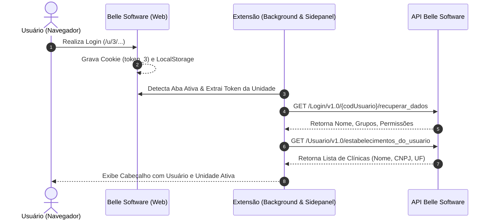

# Mapeamento Técnico: Autenticação, Sessão e Dados do Usuário (Belle Software)

Este documento detalha o fluxo completo de **autenticação, captura de tokens, sincronização de sessão e consulta aos endpoints de usuário e estabelecimentos** do Belle Software.

---

## 1. Arquitetura de Autenticação & Sessão

O Belle Software gerencia a sessão do usuário através de **Cookies HTTP** e **LocalStorage** particionados por unidade/estabelecimento.



---

## 2. Captura do Token de Autorização

### 2.1. Estrutura dos Cookies de Sessão

Quando o operador acessa uma unidade (ex: `https://app.bellesoftware.com.br/u/3/`), o Belle gera um cookie específico com o prefixo da unidade:

| Nome do Cookie | Exemplo de Valor | Descrição |
| :--- | :--- | :--- |
| `token_3` | `1fcd27be502d5f37e4d67cadd2c1a0d8` | Token de autorização para a unidade #3 |
| `token_1` | `9bca18df628d44a2b130e981fae87901` | Token de autorização para a unidade #1 |
| `token` / `authToken` | `1fcd27be502d5f37e4d67cadd2c1a0d8` | Fallback de sessão global |

### 2.2. Extração Segura via Background Script (Chrome API)

```javascript
// background.js
chrome.runtime.onMessage.addListener((request, sender, sendResponse) => {
  if (request.action === "GET_BELLE_COOKIES") {
    chrome.cookies.getAll({ domain: "bellesoftware.com.br" }, (cookies) => {
      sendResponse({ cookies: cookies || [] });
    });
    return true;
  }
});
```

---

## 3. Endpoints de Usuário e Estabelecimentos

### 3.1. Endpoint 1: Recuperar Dados do Usuário Logado

* **Finalidade:** Retorna o perfil completo do usuário autenticado (nome completo, login, e-mail, grupo de permissão e configurações).
* **Método:** `GET`
* **URL:**
```http
https://app.bellesoftware.com.br/api/release/controller/Login/v1.0/{codUsuario}/recuperar_dados?estabGeral=
```

#### Parâmetros de Requisição:
| Parâmetro / Header | Tipo | Obrigatório | Descrição |
| :--- | :--- | :--- | :--- |
| **`codUsuario`** (Path) | `String` | Sim | Código ou login do usuário (ex: `master-admin` ou ID numérico como `82700`). |
| **`authorization`** (Header) | `String` | Sim | Token MD5/Hex obtido do cookie da sessão ativa. |
| **`estabGeral`** (Query) | `String` | Não | Parâmetro de escopo geral (pode ser enviado vazio). |

#### Exemplo de Chamada (JavaScript / Fetch):
```javascript
const codUsuario = "master-admin";
const token = "1fcd27be502d5f37e4d67cadd2c1a0d8";

const response = await fetch(`https://app.bellesoftware.com.br/api/release/controller/Login/v1.0/${encodeURIComponent(codUsuario)}/recuperar_dados?estabGeral=`, {
  method: "GET",
  headers: {
    "authorization": token,
    "accept": "application/json, text/plain, */*"
  }
});

const userData = await response.json();
console.log("Usuário logado:", userData.nom_usuario);
```

#### Exemplo de Resposta (JSON):
```json
{
  "cod_usuario": "master-admin",
  "nom_usuario": "Master - Patrícia Karla",
  "login": "master-admin",
  "email": "contato@esteticaelaser.com.br",
  "ativo": 1,
  "grupos": [
    {
      "id": 1,
      "nome": "Master / Administrador Geral",
      "nivel": 10
    }
  ],
  "foto": null,
  "configuracoes": {
    "exibir_valores": true,
    "pode_cancelar": true,
    "pode_estornar": true
  }
}
```

---

### 3.2. Endpoint 2: Estabelecimentos do Usuário

* **Finalidade:** Lista todas as clínicas e unidades às quais o usuário autenticado tem permissão de acesso, com razão social, CNPJ e indicação da unidade padrão.
* **Método:** `GET`
* **URL:**
```http
https://app.bellesoftware.com.br/api/release/controller/Usuario/v1.0/estabelecimentos_do_usuario?estabGeral=
```

#### Parâmetros de Requisição:
| Parâmetro / Header | Tipo | Obrigatório | Descrição |
| :--- | :--- | :--- | :--- |
| **`authorization`** (Header) | `String` | Sim | Token de autorização da sessão. |
| **`estabGeral`** (Query) | `String` | Não | Parâmetro de escopo da rede. |

#### Exemplo de Chamada (JavaScript / Fetch):
```javascript
const response = await fetch("https://app.bellesoftware.com.br/api/release/controller/Usuario/v1.0/estabelecimentos_do_usuario?estabGeral=", {
  method: "GET",
  headers: {
    "authorization": token,
    "accept": "application/json, text/plain, */*"
  }
});

const estabelecimentos = await response.json();
```

#### Exemplo de Resposta (JSON):
```json
[
  {
    "cod": 1,
    "nome": "ESTETICA E LASER LINHARES",
    "razao_social": "ESTETICA E LASER LINHARES LTDA",
    "cnpj": "12.345.678/0001-90",
    "uf": "ES",
    "cidade": "Linhares",
    "padrao": 1,
    "ativo": 1
  },
  {
    "cod": 3,
    "nome": "ESTETICA E LASER COLATINA",
    "razao_social": "ESTETICA E LASER COLATINA LTDA",
    "cnpj": "98.765.432/0001-10",
    "uf": "ES",
    "cidade": "Colatina",
    "padrao": 0,
    "ativo": 1
  }
]
```

---

## 4. Extração Complementar no DOM da Página (`content.js`)

Caso a requisição de API esteja em transição, a extensão possui extratores diretos injetados na aba ativa:

```javascript
// Extração de dados da interface ativa
function extrairContextoPagina() {
  return {
    // Detecta ID da unidade na URL (ex: /u/3/ -> 3)
    codEstab: window.location.pathname.match(/\/u\/(\d+)/)?.[1] || 1,
    
    // Nome do usuário exibido na barra superior
    userName: document.querySelector(".user-profile-name, .user-name, .header-user")?.textContent?.trim() || null,
    
    // Tokens armazenados no LocalStorage
    localStorage: { ...window.localStorage }
  };
}
```

---

## 5. Regras Críticas de Operação

1. **`codEstab` na API:**
   - Nas requisições de API (`vendasplanos`, `saldovendaplano`, `listar_parcelas`), o parâmetro `codEstab` é **sempre mantido como `1`**.
2. **Token Dinâmico:**
   - O token enviado no header `authorization` varia de acordo com a unidade onde o usuário está navegando (ex: cookie `token_3` para URL `/u/3/`).
3. **Sincronização Automática:**
   - A extensão executa a sincronização do usuário e estabelecimentos imediatamente ao ser aberta e permite recarregamento manual pelo botão **🔄 Sincronizar Sessão**.
