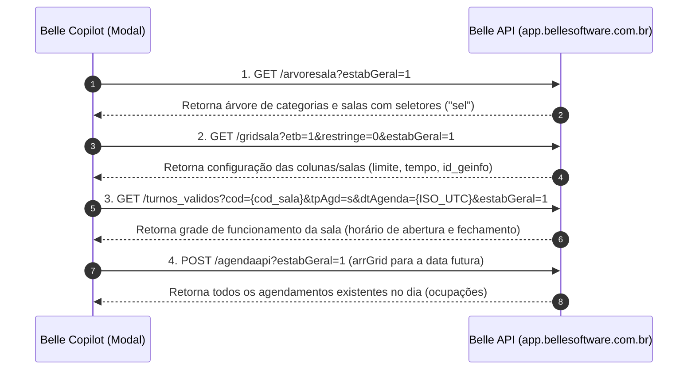

# 📅 Mapeamento do Fluxo de Disponibilidade e Agendamento no Belle Software

Este documento detalha as requisições, cabeçalhos, parâmetros e payloads interceptados da API do Belle Software para consulta de disponibilidade de horários, turnos válidos e criação de novos agendamentos na agenda da clínica.

---

## 🧭 Visão Geral do Ciclo de Disponibilidade (Etapas 1 a 4)

Ao selecionar ou sugerir uma data futura (ex: `17/10/2026` após 45 ou 25 dias de intervalo), o sistema executa o seguinte fluxo para mapear os horários 100% livres e válidos para a paciente:



---

## 1️⃣ Requisição: Árvore de Salas (`arvoresala`)

Obtém a hierarquia de setores, categorias de salas e os identificadores de seleção de cada recurso.

* **URL**: `https://app.bellesoftware.com.br/api/release/controller/Agenda/v1.0/arvoresala?estabGeral=1`
* **Método**: `GET`
* **Headers**:
  * `authorization`: Token ativo da sessão
  * `etb`: `1` (ou código do estabelecimento)
  * `restringe`: `0`
  * `accept`: `application/json, text/plain, */*`

### Exemplo de Resposta:
```json
{
  "rs": [
    {
      "codigo": 1,
      "nome": "AVALIAÇÃO",
      "checked": false,
      "title": "AVALIAÇÃO",
      "tipo": "sala",
      "area": "1",
      "items": [
        {
          "cod_sala": 1,
          "nome": "AVALIAÇÃO NOVOS CLEINTES",
          "sel": "975663",
          "limite": 9,
          "title": "AVALIAÇÃO NOVOS CLEINTES",
          "codTipo": 1,
          "nomeTipo": "AVALIAÇÃO",
          "tipo": "sala",
          "area": "2",
          "isLeaf": true,
          "checked": true,
          "codAgenda": 1
        }
      ]
    },
    {
      "codigo": 2,
      "nome": "SERVIÇOS ",
      "checked": false,
      "title": "SERVIÇOS ",
      "tipo": "sala",
      "area": "1",
      "items": [
        {
          "cod_sala": 2,
          "nome": "SALA DE DEPILAÇAO A LASER",
          "sel": "975664",
          "limite": 1,
          "title": "SALA DE DEPILAÇAO A LASER",
          "codTipo": 2,
          "nomeTipo": "SERVIÇOS ",
          "tipo": "sala",
          "area": "2",
          "isLeaf": true,
          "checked": true,
          "codAgenda": 2
        },
        {
          "cod_sala": 3,
          "nome": "PROCEDIMENTOS  (TODOS OS  OUTROS  SERVIÇOS )",
          "sel": "975665",
          "limite": 10,
          "title": "PROCEDIMENTOS  (TODOS OS  OUTROS  SERVIÇOS )",
          "codTipo": 2,
          "nomeTipo": "SERVIÇOS ",
          "tipo": "sala",
          "area": "2",
          "isLeaf": true,
          "checked": true,
          "codAgenda": 3
        }
      ]
    }
  ]
}
```

---

## 2️⃣ Requisição: Grid de Salas (`gridsala`)

Retorna a lista estruturada das salas operacionais com duração padrão de slots (`tempo`), limite de atendimentos simultâneos e `id_geinfo`.

* **URL**: `https://app.bellesoftware.com.br/api/release/controller/Agenda/v1.0/gridsala?etb=1&restringe=0&estabGeral=1`
* **Método**: `GET`
* **Headers**:
  * `authorization`: Token ativo da sessão
  * `accept`: `application/json, text/plain, */*`

### Exemplo de Resposta:
```json
[
  {
    "id_geinfo": 85015,
    "codigo": 975663,
    "login": "master-admin",
    "cod_tipo": 1,
    "cod_sala": 1,
    "todos": "1",
    "id": 1,
    "cod_clinica": "1",
    "nom_clinica": "ESTETICA E LASER MANTENA",
    "nome": "AVALIAÇÃO NOVOS CLEINTES",
    "tempo": "20",
    "limite": 9,
    "foto": "",
    "title": "AVALIAÇÃO NOVOS CLEINTES"
  },
  {
    "id_geinfo": 85015,
    "codigo": 975664,
    "login": "master-admin",
    "cod_tipo": 2,
    "cod_sala": 2,
    "todos": "1",
    "id": 2,
    "cod_clinica": "1",
    "nom_clinica": "ESTETICA E LASER MANTENA",
    "nome": "SALA DE DEPILAÇAO A LASER",
    "tempo": "5",
    "limite": 1,
    "foto": "",
    "title": "SALA DE DEPILAÇAO A LASER"
  },
  {
    "id_geinfo": 85015,
    "codigo": 975665,
    "login": "master-admin",
    "cod_tipo": 2,
    "cod_sala": 3,
    "todos": "1",
    "id": 3,
    "cod_clinica": "1",
    "nom_clinica": "ESTETICA E LASER MANTENA",
    "nome": "PROCEDIMENTOS  (TODOS OS  OUTROS  SERVIÇOS )",
    "tempo": "5",
    "limite": 10,
    "foto": "",
    "title": "PROCEDIMENTOS  (TODOS OS  OUTROS  SERVIÇOS )"
  }
]
```

---

## 3️⃣ Requisição: Turnos Válidos (`turnos_validos`)

Consulta para cada sala/recurso os horários de início e término de expediente permitidos para a data alvo.

* **URL**: `https://app.bellesoftware.com.br/api/release/controller/Buscas/v1.0/turnos_validos?cod={cod_sala}&tpAgd=s&dtAgenda={dtAgendaUtc}&estabGeral=1`
* **Método**: `GET`
* **Parâmetros de Query**:
  * `cod`: Código da Sala (ex: `1`, `2`, `3`);
  * `tpAgd`: `"s"` (Sala / Recurso);
  * `dtAgenda`: Data no formato ISO UTC (ex: `2026-10-17T03:00:00.000Z`, correspondente às 00:00 no fuso de Brasília GMT-3);
  * `estabGeral`: `1`.
* **Headers**:
  * `authorization`: Token ativo da sessão

### Exemplo de Resposta:
```json
[
  { "daysOfWeek": [1], "startTime": "08:00", "endTime": "20:00" },
  { "daysOfWeek": [1], "startTime": "08:00", "endTime": "22:00" },
  { "daysOfWeek": [2], "startTime": "08:00", "endTime": "20:00" },
  { "daysOfWeek": [2], "startTime": "08:00", "endTime": "22:00" },
  { "daysOfWeek": [3], "startTime": "08:00", "endTime": "20:00" },
  { "daysOfWeek": [3], "startTime": "08:00", "endTime": "22:00" },
  { "daysOfWeek": [4], "startTime": "08:00", "endTime": "20:00" },
  { "daysOfWeek": [4], "startTime": "08:00", "endTime": "22:00" },
  { "daysOfWeek": [5], "startTime": "08:00", "endTime": "20:00" },
  { "daysOfWeek": [5], "startTime": "08:00", "endTime": "22:00" },
  { "daysOfWeek": [6], "startTime": "08:00", "endTime": "12:00" },
  { "daysOfWeek": [6], "startTime": "12:00", "endTime": "22:00" }
]
```

---

## 4️⃣ Requisição: Ocupação do Dia (`agendaapi`)

Recupera todos os agendamentos já marcados para a data alvo na grade de salas especificada.

* **URL**: `https://app.bellesoftware.com.br/api/release/controller/Agenda/v1.0/agendaapi?estabGeral=1`
* **Método**: `POST`
* **Headers**:
  * `authorization`: Token ativo da sessão
  * `content-type`: `text/plain`
  * `accept`: `application/json, text/plain, */*`
* **Body (Payload text/plain)**:
  JSON stringificado contendo a lista de `arrGrid` para a data da consulta futura (ex: `2026-10-17`).

---

## 🧠 Algoritmo de Cálculo de Horários Livres (Disponibilidade)

Com as informações das 4 requisições:
1. **Faixa de Atendimento**: Obtida em `turnos_validos` (ex: `08:00` às `20:00`);
2. **Duração do Procedimento**: Calculada somando os tempos das áreas selecionadas (ex: 20 min);
3. **Bloqueios / Conflitos**: Extraídos de `agendaapi` (todos os agendamentos marcados entre `start_date` e `end_date` daquela sala);
4. **Horários Sugeridos**: Slots livres onde `[Horário Início, Horário Início + Duração]` não colide com agendamentos existentes na mesma sala.

---

## ⚡ 5️⃣ A Regra de Ouro: Cálculo de Horários Livres vs. Ocupados

A lógica de cálculo de disponibilidade segue o cruzamento exato entre os **Turnos Válidos** e a **Ocupação do `agendaapi`**:

```
[ Universo de Horários do Turno ]  (Ex: 08:00 às 20:00)
                MINUS (-)
[ Horários Ocupados da agendaapi ] (Ex: 08:30 - 09:00, 14:00 - 14:30)
                EQUALS (=)
[ Horários 100% Livres para Agendamento ] (Ex: 08:00, 09:00, 09:30, ...)
```

### Exemplo Prático de Matriz de Slots:
* **Turno Válido da Sala na Data**: `08:00` até `12:00` (Granularidade de 20 min):
  * Slots Possíveis: `08:00`, `08:20`, `08:40`, `09:00`, `09:20`, `09:40`, `10:00`, `10:20`, `10:40`, `11:00`, `11:20`, `11:40`.
* **Retorno da `agendaapi` para a Sala**:
  * Agendamento 1: `08:20` às `09:00` (Ocupado / Pronto)
  * Agendamento 2: `10:20` às `11:00` (Ocupado / Pronto)
* **Resultado para a Recepcionista no Modal**:
  * ✅ `08:00` (Livre)
  * ❌ `08:20` (Ocupado)
  * ❌ `08:40` (Ocupado)
  * ✅ `09:00` (Livre)
  * ✅ `09:20` (Livre)
  * ✅ `09:40` (Livre)
  * ✅ `10:00` (Livre)
  * ❌ `10:20` (Ocupado)
  * ❌ `10:40` (Ocupado)
  * ✅ `11:00` (Livre)
  * ✅ `11:20` (Livre)
  * ✅ `11:40` (Livre)

---

## 6️⃣ Requisição: Catálogo de Serviços e Duração (`/servico`)

Consulta o catálogo completo de procedimentos da clínica para mapear o código oficial (`codServico`), nome e a **duração em minutos (`tempo`)** de cada área.

* **URL**: `https://app.bellesoftware.com.br/api/release/controller/Servico/v1.0/servico?filtro=&tipo=&categoria=&ativo=0&tipoFrq=511&paginar=1&primeiro=0&ordenacao=1&limit=100&estabGeral=1`
* **Método**: `GET`
* **Headers**:
  * `authorization`: Token ativo da sessão
  * `accept`: `application/json, text/plain, */*`

### Estrutura de Campos Relevantes de Cada Serviço:
```json
{
  "codServico": 55556418,
  "nome": "AXILAS (P) - depilação a laser",
  "tempo": 5,
  "valor": "30,00",
  "nomCat": "DEPILAÇÃO A LASER",
  "id_geinfo": 124248
}
```

### ⏱️ Cálculo da Duração Total do Agendamento (Soma de Tempos):
Ao agendar múltiplas áreas para a paciente na mesma sessão:
$$\text{Duração Total} = \sum_{i=1}^{n} \text{tempo}(\text{serviço}_i)$$

* **Exemplo Prático**:
  1. `AXILAS (P)` ➔ **5 minutos** (`codServico: 55556418`)
  2. `VIRILHA COMPLETA (M)` ➔ **10 minutos** (`codServico: 55556425`)
  3. `MEIA PERNA (M)` ➔ **10 minutos** (`codServico: 55556430`)
  * **Duração Total da Reserva**: `5 + 10 + 10 = 25 minutos`
  * Se o horário de início for `09:00`, o término no Belle será `09:25`.
  * Na criação do agendamento, o payload envia o array com cada `codServico` e seu respectivo `tempo`.
